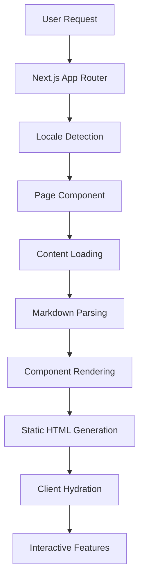
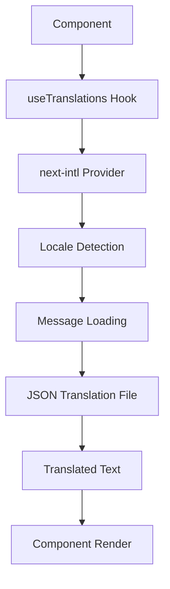
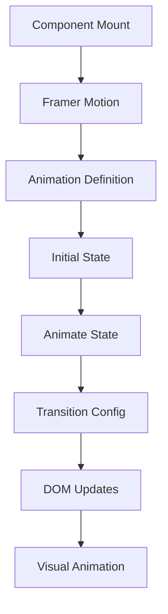
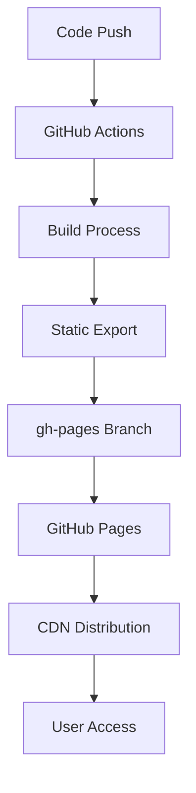

# TechStudio Architecture Guide

This document provides a comprehensive overview of the TechStudio project architecture, design decisions, and technical implementation details.

## 📋 Table of Contents

- [Architecture Overview](#architecture-overview)
- [Technology Stack](#technology-stack)
- [Project Structure](#project-structure)
- [Design Patterns](#design-patterns)
- [Data Flow](#data-flow)
- [Performance Optimizations](#performance-optimizations)
- [Security Considerations](#security-considerations)
- [Deployment Architecture](#deployment-architecture)
- [Future Considerations](#future-considerations)

## 🏗 Architecture Overview

TechStudio follows a modern, component-based architecture built on Next.js 15 with the App Router pattern. The application is designed as a static site generator optimized for GitHub Pages deployment.

### Core Principles

1. **Static-First**: Pre-rendered pages for optimal performance
2. **Component-Based**: Modular, reusable React components
3. **Type-Safe**: Full TypeScript coverage with strict typing
4. **Internationalization**: Scalable multilingual support
5. **Performance**: Optimized for Core Web Vitals
6. **Accessibility**: WCAG 2.1 AA compliant

### Architecture Diagram

```
┌─────────────────────────────────────────────────────────────┐
│                    TechStudio Architecture                    │
├─────────────────────────────────────────────────────────────┤
│  Presentation Layer (React Components)                     │
│  ├── Pages (App Router)                                     │
│  ├── Components (UI & Business Logic)                      │
│  └── Animations (Framer Motion)                            │
├─────────────────────────────────────────────────────────────┤
│  State Management & Data Layer                              │
│  ├── Next.js App Router (File-based routing)               │
│  ├── next-intl (Internationalization)                      │
│  ├── Markdown Content (Blog/Portfolio)                      │
│  └── JSON Translations (Messages)                         │
├─────────────────────────────────────────────────────────────┤
│  Styling & Theming                                          │
│  ├── Tailwind CSS (Utility-first styling)                 │
│  ├── next-themes (Dark/Light mode)                         │
│  └── Custom CSS (Animations & effects)                      │
├─────────────────────────────────────────────────────────────┤
│  Build & Deployment                                         │
│  ├── Next.js Static Export                                  │
│  ├── GitHub Actions (CI/CD)                                │
│  └── GitHub Pages (Hosting)                                 │
└─────────────────────────────────────────────────────────────┘
```

## 🛠 Technology Stack

### Frontend Framework
- **Next.js 15**: React framework with App Router
- **React 18**: Component library with concurrent features
- **TypeScript**: Type-safe JavaScript

### Styling & UI
- **Tailwind CSS**: Utility-first CSS framework
- **Radix UI**: Accessible component primitives
- **shadcn/ui**: Pre-built component library
- **Framer Motion**: Animation library
- **Lucide React**: Icon library

### Content & Data
- **Markdown**: Content authoring (blog posts, portfolio)
- **gray-matter**: Frontmatter parsing
- **react-markdown**: Markdown rendering
- **next-intl**: Internationalization

### Development Tools
- **ESLint**: Code linting
- **Prettier**: Code formatting
- **pnpm**: Package manager
- **GitHub Actions**: CI/CD

## 📁 Project Structure

### Directory Organization

```
tech-studio/
├── .github/workflows/          # CI/CD configuration
├── i18n/                       # Internationalization setup
├── messages/                   # Translation files
├── public/                     # Static assets
├── src/
│   ├── app/                    # Next.js App Router
│   │   ├── [locale]/          # Locale-based routing
│   │   ├── globals.css         # Global styles
│   │   └── layout.tsx          # Root layout
│   ├── components/             # React components
│   │   ├── ui/                 # shadcn/ui components
│   │   ├── animated-*.tsx      # Animation components
│   │   ├── *-card.tsx          # Card components
│   │   └── *-grid.tsx          # Grid components
│   ├── lib/                    # Utility functions
│   ├── middleware.ts           # Next.js middleware
│   └── types/                  # TypeScript definitions
├── content/                    # Content files
│   ├── blog/                   # Blog posts (Markdown)
│   └── portfolio/              # Portfolio projects (Markdown)
└── Configuration files
```

### File Naming Conventions

- **Components**: PascalCase (e.g., `BlogCard.tsx`)
- **Utilities**: camelCase (e.g., `blogContent.ts`)
- **Pages**: lowercase with hyphens (e.g., `page.tsx`)
- **Types**: camelCase with `.d.ts` extension
- **Content**: kebab-case (e.g., `getting-started-guide.md`)

## 🎨 Design Patterns

### Component Architecture

#### 1. Composition Pattern
```typescript
// Base card component
interface CardProps {
  children: React.ReactNode;
  className?: string;
}

// Specialized card components
interface BlogCardProps extends CardProps {
  post: BlogPost;
  featured?: boolean;
}

interface PortfolioCardProps extends CardProps {
  project: PortfolioProject;
  featured?: boolean;
}
```

#### 2. Higher-Order Components (HOCs)
```typescript
// Animation wrapper
function withAnimation<T extends object>(
  Component: React.ComponentType<T>
) {
  return function AnimatedComponent(props: T) {
    return (
      <motion.div
        initial={{ opacity: 0, y: 20 }}
        animate={{ opacity: 1, y: 0 }}
        transition={{ duration: 0.5 }}
      >
        <Component {...props} />
      </motion.div>
    );
  };
}
```

#### 3. Render Props Pattern
```typescript
// Translation provider
interface TranslationProviderProps {
  children: (t: (key: string) => string) => React.ReactNode;
}

function TranslationProvider({ children }: TranslationProviderProps) {
  const t = useTranslations();
  return <>{children(t)}</>;
}
```

### State Management Patterns

#### 1. Server State (Static Generation)
```typescript
// Static data fetching at build time
export async function generateStaticParams() {
  const posts = await getAllBlogPosts();
  return posts.map(post => ({
    slug: post.metadata.slug
  }));
}
```

#### 2. Client State (React Hooks)
```typescript
// Theme management
function useTheme() {
  const [theme, setTheme] = useState<'light' | 'dark'>('light');
  
  const toggleTheme = useCallback(() => {
    setTheme(prev => prev === 'light' ? 'dark' : 'light');
  }, []);
  
  return { theme, toggleTheme };
}
```

#### 3. URL State (Next.js Router)
```typescript
// Locale management
function useLocale() {
  const pathname = usePathname();
  const locale = pathname.split('/')[1] as 'en' | 'th';
  return locale;
}
```

## 🔄 Data Flow

### Content Loading Flow



### Translation Flow



### Animation Flow



## ⚡ Performance Optimizations

### 1. Static Site Generation (SSG)
- **Pre-rendered pages**: All pages generated at build time
- **No server required**: Static files served from CDN
- **Instant loading**: No server-side processing delays

### 2. Image Optimization
```typescript
// Next.js Image component with optimization
<Image
  src={post.metadata.image}
  alt={post.metadata.title}
  width={400}
  height={250}
  className="rounded-lg"
  priority={featured} // Prioritize above-the-fold images
/>
```

### 3. Bundle Optimization
- **Code splitting**: Automatic route-based splitting
- **Tree shaking**: Unused code elimination
- **Dynamic imports**: Lazy loading of components

### 4. Caching Strategy
- **Static assets**: Long-term caching (1 year)
- **HTML pages**: Medium-term caching (1 hour)
- **API responses**: Short-term caching (5 minutes)

### 5. Core Web Vitals Optimization
- **LCP**: Optimized images and fonts
- **FID**: Minimal JavaScript execution
- **CLS**: Stable layout with proper sizing

## 🔒 Security Considerations

### 1. Content Security Policy (CSP)
```typescript
// Next.js security headers
const securityHeaders = [
  {
    key: 'Content-Security-Policy',
    value: "default-src 'self'; script-src 'self' 'unsafe-eval'; style-src 'self' 'unsafe-inline';"
  }
];
```

### 2. Input Sanitization
```typescript
// Markdown content sanitization
import DOMPurify from 'isomorphic-dompurify';

function sanitizeMarkdown(content: string): string {
  return DOMPurify.sanitize(content);
}
```

### 3. Environment Variables
- **No secrets in client code**: All sensitive data server-side only
- **Build-time configuration**: Environment variables at build time
- **Public variables**: Only non-sensitive data exposed to client

### 4. Dependency Security
- **Regular updates**: Automated dependency updates
- **Vulnerability scanning**: GitHub Dependabot integration
- **Minimal dependencies**: Only essential packages included

## 🚀 Deployment Architecture

### GitHub Pages Deployment



### Build Process
1. **Environment Setup**: Node.js 22.x, pnpm
2. **Dependency Installation**: `pnpm install --frozen-lockfile`
3. **Type Checking**: TypeScript compilation
4. **Linting**: ESLint code quality checks
5. **Build**: Next.js static export
6. **Deploy**: Upload to gh-pages branch

### Configuration Files

#### next.config.ts
```typescript
const nextConfig: NextConfig = {
  output: 'export',           // Static export for GitHub Pages
  trailingSlash: true,       // URL compatibility
  assetPrefix: '/tech-studio', // Asset path prefix
  basePath: '/tech-studio',   // Base URL path
  images: {
    unoptimized: true,       // Required for static export
  },
};
```

#### deployment.yml
```yaml
name: Deploy to GitHub Pages
on:
  push:
    branches: [main]
jobs:
  build-and-deploy:
    runs-on: ubuntu-22.04
    steps:
      - uses: actions/checkout@v4
      - uses: actions/setup-node@v4
      - uses: pnpm/action-setup@v3
      - run: NODE_ENV=production pnpm run build
      - uses: peaceiris/actions-gh-pages@v4
```

## 🔮 Future Considerations

### Scalability Improvements
1. **Content Management**: Headless CMS integration
2. **Database**: PostgreSQL for dynamic content
3. **Search**: Full-text search implementation
4. **Analytics**: User behavior tracking
5. **A/B Testing**: Feature flag system

### Performance Enhancements
1. **Edge Computing**: Vercel Edge Functions
2. **Progressive Web App**: Offline functionality
3. **Service Workers**: Background sync
4. **WebAssembly**: Performance-critical operations
5. **HTTP/3**: Next-generation protocol

### Developer Experience
1. **Storybook**: Component documentation
2. **Testing**: Jest + React Testing Library
3. **E2E Testing**: Playwright integration
4. **Monitoring**: Error tracking and performance
5. **Documentation**: Automated API docs

### Content Strategy
1. **Multi-language**: Additional language support
2. **Rich Media**: Video and interactive content
3. **User Generated Content**: Comments and reviews
4. **Personalization**: User-specific content
5. **SEO**: Advanced optimization techniques

## 📊 Monitoring & Analytics

### Performance Monitoring
- **Core Web Vitals**: LCP, FID, CLS tracking
- **Bundle Analysis**: Webpack bundle analyzer
- **Build Metrics**: Build time and size tracking
- **Error Tracking**: Client-side error monitoring

### User Analytics
- **Page Views**: Traffic and engagement metrics
- **User Behavior**: Click tracking and heatmaps
- **Conversion**: Goal completion tracking
- **A/B Testing**: Feature performance comparison

## 🧪 Testing Strategy

### Unit Testing
```typescript
// Component testing example
import { render, screen } from '@testing-library/react';
import BlogCard from '@/components/blog-card';

test('renders blog card with title', () => {
  const mockPost = {
    metadata: {
      title: 'Test Post',
      excerpt: 'Test excerpt',
      date: '2024-01-01',
      slug: 'test-post'
    }
  };
  
  render(<BlogCard post={mockPost} />);
  expect(screen.getByText('Test Post')).toBeInTheDocument();
});
```

### Integration Testing
- **Page rendering**: Full page component tests
- **Navigation**: Route and link testing
- **Form submission**: User interaction testing
- **API integration**: Data fetching tests

### End-to-End Testing
- **User journeys**: Complete workflow testing
- **Cross-browser**: Multi-browser compatibility
- **Mobile testing**: Responsive design validation
- **Accessibility**: Screen reader compatibility

## 📚 Documentation Standards

### Code Documentation
- **JSDoc**: Function and component documentation
- **Type definitions**: Comprehensive TypeScript types
- **README files**: Component usage examples
- **Architecture docs**: System design documentation

### API Documentation
- **OpenAPI**: REST API specification
- **GraphQL Schema**: Query and mutation documentation
- **Webhook docs**: Event and payload documentation
- **SDK docs**: Client library documentation

This architecture guide provides a comprehensive foundation for understanding and extending the TechStudio project. For specific implementation details, refer to the individual component documentation and code comments.
